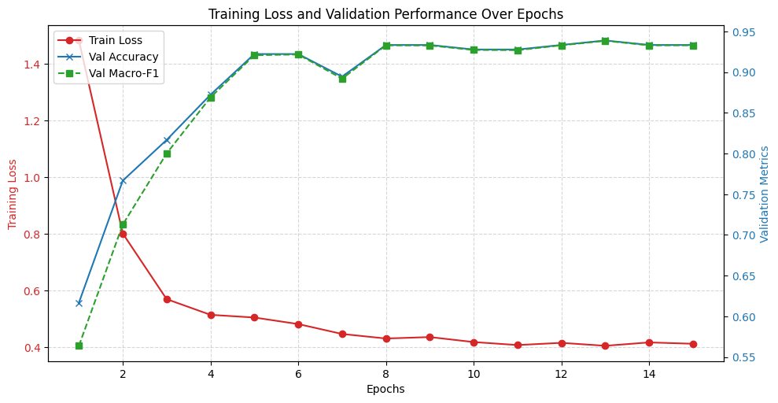
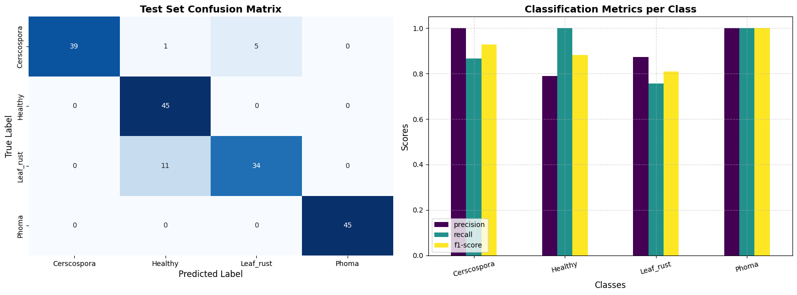

# Coffee Leaf Checker

An offline-capable, on-device coffee leaf helper for Ethiopian smallholder farmers. Take a close-up photo of **one affected spot in daylight** to see cautious advice in Amharic, Afaan Oromo or English. If the model cannot answer confidently, the app says to ask an extension officer rather than naming a disease. It is **not a diagnosis**.

The PWA uses a four-class EfficientNet-B0 ONNX model and local onnxruntime-web WASM. Photos are processed on the device; there is no inference API, account or automatic upload. The farmer can optionally save a compressed photo, the **result actually shown**, and a timestamp in IndexedDB on that device, then manually share it with an officer. On phones without file sharing, copy the message and download/attach the photo separately.

## Run and test

```sh
python serve.py
# Open http://localhost:8000/ (append ?debug=1 for model probabilities in the console)
```

Use `serve.py` for correct `.mjs` and `.wasm` MIME types. Camera access and the service worker require HTTPS or localhost. For an offline test, open the app once online and wait for the model to load, then switch the phone to airplane mode and reload it. Check inference, audio, saved photos, reload, share and delete. The model and runtime together are about 30 MB on first visit; test the download on the intended connection.

Deploy the **contents of this directory** as a static site (for example with `vercel --prod` from this directory). Do not deploy the parent folder containing experimental models, WAV sources and ZIP archives. The 15 small MP3 clips in `audio/` are named for the model keys and language codes; the model's key `Cerscospora` is intentionally misspelled to match `model/labels.json`.

## Training evidence and limitations





The provided held-out confusion matrix contains **163 correct classifications out of 180 images (90.6%)** before the app's abstention thresholds. In that test, **11 leaf-rust images were classified as Healthy**. The app requires a higher confidence for Healthy (0.90), but these charts do **not** demonstrate that the threshold eliminates those errors. Do not interpret the validation curves or small field-photo checks as accuracy guarantees on farmers' phones.

The deployed model covers only `Cerscospora` (Cercospora leaf spot), `Healthy`, `Leaf_rust` and `Phoma`. It cannot recognize leaf miner, nutrient deficiency, drought or other conditions; high confidence is not proof of correctness. The Ethiopian training data comes from one source and has no independently verified external-field evaluation. A close-up training image and a whole-leaf phone photo may behave differently. Advice was marked reviewed by the project owner; a qualified local extension worker should check disease-specific recommendations before field use.

Thresholds, preprocessing and the optional debug output are in `app.js`. Keep `model/model.onnx` and `model/labels.json` in the same class order. The old five-class public model is **not** the model shipped here. Do not lower safety thresholds just to show more results.

## Credits and provenance

- Ethiopian coffee-leaf training dataset: Kaggle, reported by the project owner as CC0 1.0. **Add the exact dataset title and URL before public submission**; the source is not recorded in this repository.
- Huyt, [arabica-coffee-leaf-disease-efficientnet-b0](https://huggingface.co/Huyt/arabica-coffee-leaf-disease-efficientnet-b0) (CC BY 4.0): public baseline evaluated during development, not the deployed Ethiopian model.
- Jepkoech et al. (2021), *Arabica coffee leaf images dataset for coffee leaf disease detection and classification*, Data in Brief 36:107142 (JMuBEN), the dataset associated with that public baseline.
- [onnxruntime-web](https://github.com/microsoft/onnxruntime) (MIT).
